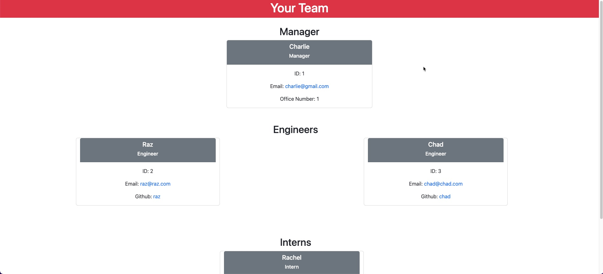

# Team Profile Generator

## Description

This application generates team members using Inquirer, FS to write the file, and Jest for testing. It will ask a series of question asking you to first enter your manager's name. It will then take you to a screen to ask you to add new employees (engineers, or interns) to the employee list. Once you've entered all of the team members it will generate an HTML file for you with each of the team member's information depending on what type of team member they are. The application utilizes constructor classes to organize the different classes that are necessary.

I've created a demo video to go over how the application works. You can view it here:


## Table of Contents

* [Installation](#installation)
* [Usage](#Usage)
* [Screenshot](#Screenshot)
* [Questions](#Questions)


## Installation

Ensure that Node.js is downloaded, and then run the following  command to install necessary packages:

```
npm i
```


## Usage

To start the application run 

```
node script.js
```

From here, follow the prompts to generate your team profile page.

The new HTML file is located under the dist folder.

## Screenshot


## Questions

If you have any questions or concerns reach me on Github @gdjewell or on email at gdjewell@gmail.com
